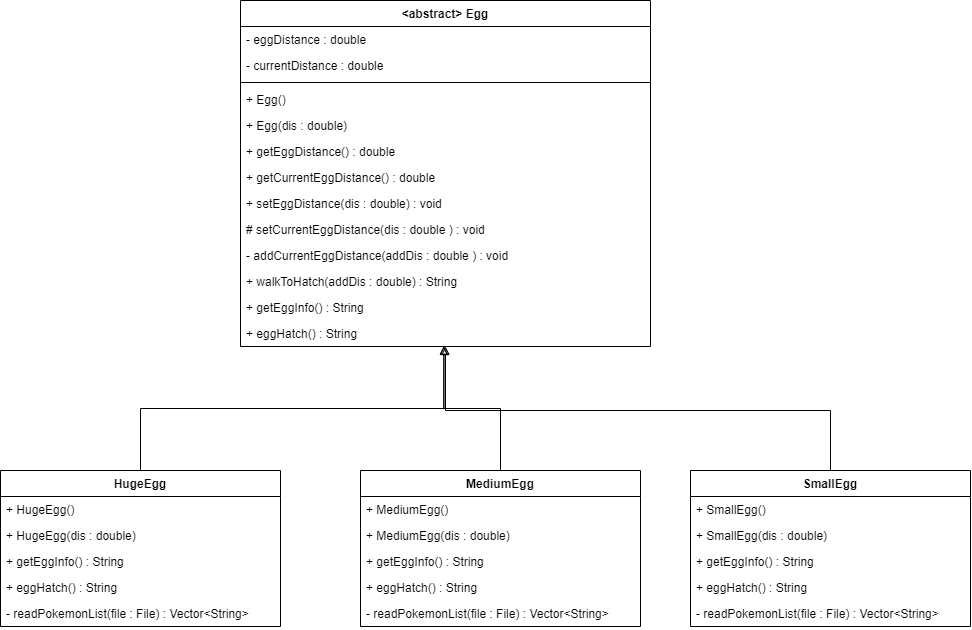

# Mini-project
> Written by 642115003 Kan Katpark    
> Discord: Query#1976    
> Email: kan_k@cmu.ac.th  
> Github: <a href="https://github.com/hoshizaki-iori">hoshizaki-iori</a>  


# Description  
  This java program is a hachting pokemon egg simulation program.  
  The program contains Pokemon egg class with 3 sizes for egg and 1 mother class.    
  1. small egg extends egg    
  2. medium egg extends egg  
  3. huge egg extends egg  

  On each egg has special Hatching Time , Hatching Distance and List of Pokemon of each egg size.

# How to run  
1. Open to source code folder.  


2. Open Command prompt or Powershell at the source code directory.  


3. Compile code by type:  
    ```
	 javac *.java
    ```
4. Run  
    ```
    java Main.java  
    ```   

# How to play  
Menu 
```
Enter e to Get more egg
Enter w to Go to walk
Enter l to See your pokemon list
Enter x to Exit
```  
**Get more egg (E) :**   
Randomly give egg to the player. then add the egg to the queue.  
  
**Go to walk (W) :**  
Walk to hatch an egg from the queue.  
  
**See Pokemon List (L) :**  
Display all of your pokemon.  
  
**Exit (X) :**  
Close the program.  

# Class Diagram

